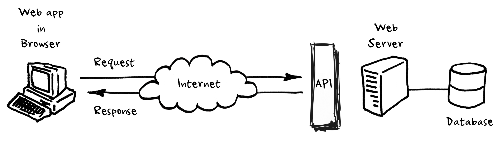
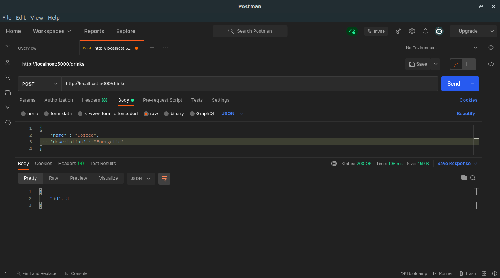
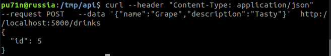

# Explaining API

This is a basic flask app that stores drinks information inside an Object Relational database (SQLAlchemy) and uses REST api to manipulate its data, I've used this simple app to explain how  REST api works during a university project.

## What is REST API

### Application Programming Interface

In basic terms, APIs just allow applications to communicate with one another.

When people speak of “an API”, they sometimes generalize and actually mean “a publicly available web-based API that returns data, likely in JSON or XML”. The API is not the database or even the server, it is the code that governs the access point(s) for the server.



We can send an API a request detailing the information we want.
APIs allow our sites to alter data on other applications, too. For instance, you’ve probably seen “Share on Facebook” or “Share on Twitter” buttons on miscellaneous websites. When/if you click one of these buttons, the site you’re visiting can communicate with your Facebook or Twitter account, and alter its data by adding new status or tweet.

### REpresentational State Transfer

Before we dive into what makes an API RESTful and what constraints and rules you should follow if you want to create RESTful APIs, let’s explain 2 key terms:

**Client** — the client is the person or software who uses the API. It can be a developer, for example you, as a developer, can use Twitter API to read and write data from Twitter, create a new tweet and do more actions in a program that you write. Your program will call Twitter’s API. The client can also be a web browser. When you go to Twitter website, your browser is the client who calls Twitter API and uses the returned data to render information on the screen.

**Resource** — a resource can be any object the API can provide information about. In Instagram’s API, for example, a resource can be a user, a photo, a hashtag. Each resource has a unique identifier. The identifier can be a name or a number.

Now let’s get back to REST.

A RESTful web application exposes information about itself in the form of information about its resources. It also enables the client to take actions on those resources, such as create new resources (i.e. create a new user) or change existing resources (i.e. edit a post).

In order for your APIs to be RESTful, you have to follow a set of constraints when you write them. The REST set of constraints will make your APIs easier to use and also easier to discover, meaning a developer who is just starting to use your APIs will have an easier time learning how to do so.

## Usage

Requirements :

- git
- python3
- pip3
- POSTMAN / CURL

```bash
git clone https://github.com/seifallahhomrani1/api.git
cd api
pip3 install -r requirements.txt
export FLASK_APP=application.py
export FLASK_ENV=development
flask run
```

Basically, nothing fancy will happen, just a "Hello!" message will be printed in the screen when you visit http://127.0.0.1:5000/ and that's our first function

```python
@app.route('/')
def index():


    return "Hello!"

```

### get\_drinks()

First, We query all the drinks available in the database, then we put them inside a list after that we print them out.


```python
@app.route('/drinks')
def get_drinks():
    drinks = drink.query.all()

    output = []
    for Drink in drinks :
        Drink_data = {'description':Drink.description,'name': Drink.name}
        output.append(Drink_data)

    return {"drinks": output}

```

### get\_drink(id)

This function will print out a drink based on a given id as a url parameter

```python

@app.route('/drinks/<id>')

def get_drink(id):
    Drink = drink.query.get_or_404(id)
    return {"name": Drink.name, "description": Drink.description}

```

### add_drink()

Using the *POST* method, we can pass json data to our code which will insert it inside our database called *db* and then return the new drink id as a json.

```python
@app.route('/drinks', methods=['POST'])

def add_drink():
    Drink = drink( description=request.json['description'], name=request.json['name'])
    db.session.add(Drink)
    db.session.commit()

    return {"id": Drink.id}
```

In order to insert the data as a json we can use *POSTMAN* or cURL :

## POSTMAN



## cURL

```bash
 curl --header "Content-Type: application/json"   --request POST   --data '{"name":"Water","description":"Necessary"}'http://localhost:5000/drinks
```



### delete_drink()

Using the *DELETE* method, we can delete a drink based on its id which is passed to the function as a URL parameter. 

```python

@app.route('/drinks/<id>', methods=['DELETE'])

def delete_drink(id):
    Drink = drink.query.get(id)
    if Drink is None: 
        return {"ERROR": "Drink not found"}
    db.session.delete(Drink)
    db.session.commit()

    return {"Success": f"{Drink.name} Deleted"}

```
